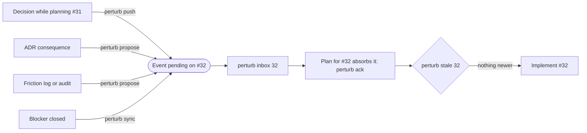

# perturb

**A planning ledger for GitHub issues.** When a decision made on one piece of work changes
another, perturb makes sure the other one hears about it before anyone plans or builds it.

It was designed for agentic development, where every planning or implementing session starts
cold, and it works just as well for people at a terminal.

## The problem

Work is split into issues, and the decisions that shape them get made all over the place: while
planning a neighbouring issue, in an architecture decision record (ADR), in the review of a
finished piece of work. Those decisions are written down where they are *made*, not where they
are *needed*.

Take a bike-share app with an epic to backfill historical data:

- Planning **#31** (backfill fares), you decide fare periods are half-open. **#32** (backfill
  refunds) depends on fare periods, but its issue says nothing about it, so whoever plans #32 next
  month doesn't know.
- An ADR decides that every refund records its grain, the period it covers (a day, a month or a
  year), and names #13 in its consequences. Nothing puts that in front of the person planning #13.
- **#29** was planned last week and is ready to implement. Yesterday a decision changed its scope.
  The implementer, often an agent with no planning context, builds the old plan.

People cope by remembering. Agents can't: each session knows the issue text and whatever it is
told to read, and nothing more.

## How perturb solves it

perturb keeps a ledger of **events** in your repository. Each one says *"this changed something that
may affect that issue."*



1. **Events connect a source to the issue it affects.** Record one by hand with `perturb push`, or
   let perturb propose them from ADRs, from plans, and from the friction logs and audits that
   implementation leaves behind. Proposals wait for a person or a planning agent to confirm them,
   so they never turn into noise. Closing a blocker records an `unblock` event automatically.
2. **Every issue has an inbox.** Whoever plans the issue reads it (`perturb inbox 32`), folds each
   event into the plan, and acknowledges it (`perturb ack`) with a note on what they did. The
   acknowledgement pins the exact version of the plan that absorbed the event.
3. **A stale gate stands before implementation.** `perturb stale 32` fails if an event arrived after
   the plan was last committed, or if the plan changed after it was acknowledged. Run it before
   building, by hand or as the first step of an agent's run.

Around the ledger, perturb reads sub-issues and blocked-by links from GitHub to answer *what should
be planned next* (`perturb next`), and `perturb check` lints the whole thing in CI.

GitHub stays the source of truth for issues. Events are small YAML files committed next to your
code and reviewed in the same pull request as the change that caused them.

### Areas

Many findings are about code rather than an issue: a friction log shows a run touched
`src/core/fares/`, or an ADR changes anything that prices a ride. An **area** is a named part of your
codebase, declared by hand as path globs in `perturb/areas.yaml`:

```yaml
areas:
  fares:
    paths: ["src/core/fares/**", "migrations/*fare*"]
```

An issue belongs to an area when it carries the `area:fares` label or its plan lists
`areas: [fares]`. perturb then proposes findings about those paths, and ADR consequences that
`affects: [area:fares]`, to the open issues in that area. A handful of areas is usually enough.

## Built for agents, fine for people

- **Machine-readable.** Every verb takes `--json` and prints a stable envelope, with a `reason` when
  it refuses; gates report through exit codes.
- **Fails closed.** Verbs that need GitHub sync first and refuse rather than answer from a stale
  cache.
- **Review built in.** A proposed event does nothing until an agent's planning step or a person
  confirms it.
- **Guides, not prescriptions.** perturb doesn't ship planning, implementing or reviewing agents.
  A guide for each phase shows where perturb fits and why, with example instructions to adapt into
  whatever prompts or skills you already use. A small [agent skill](docs/agents.md#the-perturb-skill),
  installable as a Claude Code plugin, answers "what's next?" or "is 29 still valid?".
- **By hand.** The same verbs work at a terminal, and `perturb propose adr:0002 --review` walks you
  through proposals interactively.

## Downsides

- **GitHub only, and online.** Issues, sub-issues and blocked-by links must live on GitHub, and the
  graph is only as good as your use of them. Verbs that read the issue graph sync first and refuse
  when GitHub is unreachable; the ledger verbs (`inbox`, `ack`, `confirm`, `dismiss`) and `init`
  work offline.
- **It runs on discipline.** The ledger knows only what gets pushed, confirmed and acknowledged. If
  decisions aren't recorded or inboxes aren't read, it quietly says nothing. Someone, or some
  agent's planning step, has to own that.
- **More files in your pull requests.** Every event is a committed YAML file, so reviews carry
  ledger changes alongside code.
- **Branches blur the stale gate.** `stale` compares when an event was created with when the plan
  was last committed. An event recorded on a branch that merges after someone else has planned
  the issue slips past the gate: it still waits in the inbox, but nothing fails. Each person also
  sees only their own checkout, so events on unmerged branches are invisible to `inbox`, `stale`
  and CI. Short-lived branches and checking an up-to-date `main` before implementing help.
- **Parallel work duplicates and scatters events.** Duplicates are only detected within your own
  checkout, so two people proposing from the same ADR, or both syncing after a blocker closes,
  record the same event twice. Because a sync can write `unblock` events, they can land in
  unrelated pull requests. And proposals need a clear owner, or they pile up unreviewed.
- **Proposals are heuristics.** Routing uses `#N` mentions and path globs in a hand-maintained
  `areas.yaml`. Loose areas mean noisy proposals to dismiss; missing areas mean findings that reach
  nobody. How well the rules hold up on real projects is not yet measured.
- **The stale gate is coarse.** Any pending event newer than the plan's last commit marks it
  stale, however small the change, and any edit to an acknowledged plan, even a typo fix, means
  acknowledging its events again.
- **It assumes a way of planning.** Plans must be Markdown files with `closes:` front-matter, and
  issues need the ready-to-implement label. Plans kept in issue bodies, documents or tickets
  elsewhere don't count.
- **Some sources need specific formats.** ADR proposals need the [structured ADR
  format](docs/adr-format.md) (`perturb adr migrate` converts prose ADRs). Friction and audit
  proposals need files in the [run evidence format](docs/run-evidence-format.md). Your workflow
  has to write them, though a friction log only needs a list of commits.
- **One repository at a time.** There is no ledger across repositories.
- **Early.** Formats and JSON output may change before 1.0, and it isn't published to PyPI.

## Install

You need Python 3.11+, `git`, a repository hosted on GitHub, and the [`gh`](https://cli.github.com/)
CLI logged in (or `GH_TOKEN` set). If you use a wrapper around `gh`, point `PERTURB_GH` at it.

```sh
uv tool install git+https://github.com/geuben/perturb
```

## Quick start

```sh
cd your-repo
perturb init          # creates perturb/: areas.yaml, config.yaml, README.md, events/
perturb next          # ready, unplanned issues, the ones that unblock the most first
perturb inbox 32      # what has changed for #32

# Planning #31, you lock a decision that affects #32:
perturb push --from 31 --to 32 --kind decision "Fare periods are half-open"

# Planning #32: fold the event into the plan, commit the plan, then acknowledge it.
perturb ack 32 --all --plan tasks/backfill-refunds.md --note "Design decision 1"

perturb stale 32      # exit 0: the plan has seen everything
perturb check         # the same checks, for CI
```

Commit the `perturb/` directory along with your work; `perturb init` has already added its local
cache, `.perturb/`, to `.gitignore`. To run the checks on every pull request, see
[Getting started](docs/getting-started.md#run-the-checks-in-ci).

A plan is a Markdown file with `closes: <issue number>` in its front-matter, at `tasks/<slug>.md` by
default. An issue counts as planned once its plan exists and the issue carries the
`ready-to-implement` label. Both are configurable in `perturb/config.yaml`, along with where
friction logs and audits live; declare your codebase's [areas](#areas) in `perturb/areas.yaml` so
friction reaches the issues that touch the same code.

## Status

Early. Version `0.0.1` does everything described here and is used to build perturb itself, but the
JSON envelope and file formats may still change.

## Documentation

- [Getting started](docs/getting-started.md): set up a repository and walk through the whole loop
- [Concepts](docs/concepts.md): events, inboxes, the stale gate, areas and the issue graph
- [Using perturb with agents](docs/agents.md), with a guide for each phase:
  [planning](docs/planning.md), [implementing](docs/implementing.md) and
  [reviewing](docs/reviewing.md)
- [Using perturb with tdd-cli](docs/tdd-cli.md): what a test-driven executor gives perturb for free
- [Working in a team](docs/teams.md): branches, duplicates and the habits that avoid them
- [CLI reference](docs/cli.md) and [configuration](docs/configuration.md)
- Formats: [ADRs](docs/adr-format.md) and [plans, friction logs and audits](docs/run-evidence-format.md)
- [Design notes](docs/design/README.md): why perturb is built the way it is

## Contributing

See [CONTRIBUTING.md](CONTRIBUTING.md) for development setup and how this repository uses perturb to
build perturb.

## License

MIT
